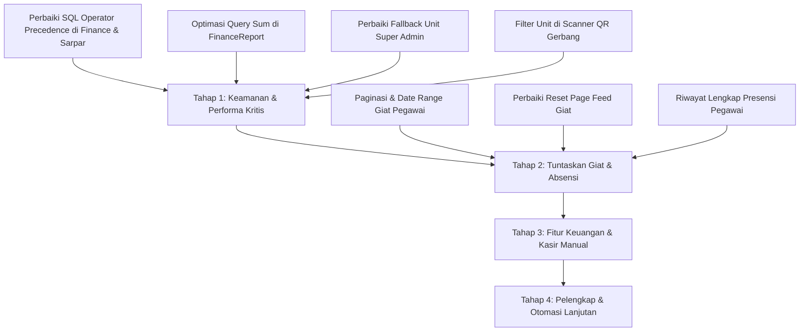

# 📑 LAPORAN AUDIT LENGKAP FITUR, KEAMANAN & PERFORMA
## SuperApp Yayasan Namira v2
*Tanggal Audit: 6 September 2026*  
*Target: Seluruh Modul Aplikasi (Backend Laravel 12 + Frontend Inertia Vue 3 + Database MySQL)*

---

## 1. RINGKASAN EKSEKUTIF (EXECUTIVE SUMMARY)

Audit ini dilakukan secara menyeluruh mencakup **58 Controller**, sistem routing, otorisasi multi-unit (Spatie RBAC), pengelolaan memori query, serta pengalaman pengguna (*user experience*) pada **9 Modul Utama**:
1. **Yayasan** (Manajemen Unit, Pengguna, Monitoring, Approval Absensi, Hari Libur, Rekrutmen)
2. **Employee** (Presensi Pegawai, Logbook Giat Tugas, Profil Kepegawaian)
3. **Finance** (Tagihan Siswa, Transaksi Kas/Bank, Rekap Tunggakan, Akun & Jenis Biaya)
4. **Academic** (Kenaikan Kelas, Data Siswa, Kelas, Jadwal, Jurnal Mengajar, Presensi Siswa, Scanner QR Gerbang)
5. **Sarpar** (Inventaris, Peminjaman Barang, Pemeliharaan, Ruangan, Label Aset)
6. **Daycare** (Data Anak, Presensi Daycare, Log Harian Anak, Jurnal Perkembangan, Laporan Harian)
7. **Counseling / BK** (Pelanggaran Siswa, Prestasi Siswa, Sesi Konseling)
8. **Public Relations / Humas** (Berita, Agenda Event, Karir, Testimoni, Mitra)
9. **LMS** (Kelas Virtual, Materi Pembelajaran, Tugas & Pengumpulan)

### 📊 Metrik Temuan:
* 🔴 **Prioritas Tinggi (Critical / Data Leak / Memory Risk)**: 4 Temuan
* 🟡 **Prioritas Sedang (Functional Gap / Pagination / UX / N+1 Query)**: 6 Temuan
* 🟢 **Prioritas Rendah & Peningkatan (Enhancements & Otomasi)**: 5 Temuan

---

## 2. TABEL MATRIKS REKAPITULASI TEMUAN

| ID | Modul | Kategori | Tingkat Risiko | Deskripsi Singkat Masalah |
| :--- | :--- | :--- | :---: | :--- |
| **SEC-01** | Finance | Keamanan & Data Leak | 🔴 TINGGI | `orWhere` tanpa closure membocorkan tagihan lintas unit saat search `bill_code`. |
| **SEC-02** | Sarpar | Keamanan & Data Leak | 🔴 TINGGI | `orWhereHas` tanpa closure membocorkan data peminjaman inventaris lintas unit. |
| **PERF-01**| Finance | Performa & Memori | 🔴 TINGGI | Rekap tunggakan memuat ribuan objek model ke RAM untuk sekadar menghitung sum. |
| **AUTH-01**| Academic & Sarpar | Logika Akses | 🔴 TINGGI | Super Admin Yayasan melihat layar kosong jika belum switch unit di session. |
| **SEC-03** | Academic | Multi-Unit Isolation | 🔴 TINGGI | Scanner QR gerbang (`StudentCheckin`) tidak memfilter unit, mencampur siswa SD/SMP/SMA. |
| **UX-01**  | Employee | Kelengkapan Fitur | 🟡 SEDANG | Logbook giat pribadi (`ActivityLogs/Index`) di-hardcode limit 20 tanpa paginasi. |
| **UX-02**  | Yayasan | UX & Navigasi | 🟡 SEDANG | Feed giat tidak me-reset pagination ke `page=1` saat filter/pencarian diubah. |
| **PERF-02**| Finance | Database Query (N+1) | 🟡 SEDANG | Relasi `bills.financeType` tidak dieager-load memicu puluhan query berulang. |
| **FUNC-01**| Finance | Fitur Belum Selesai | 🟡 SEDANG | Input manual transaksi tunai/kasir (`TransactionController::create`) masih stub kosong. |
| **FUNC-02**| Employee | Transparansi Pegawai | 🟡 SEDANG | Riwayat absensi pegawai hanya dibatasi 10 data terakhir tanpa pagination/rekap bulanan. |
| **FUNC-03**| LMS | Multi-Tenancy Yayasan | 🟡 SEDANG | List kelas LMS untuk level Yayasan tidak memiliki filter unit dan tanpa pagination. |
| **ENH-01** | Daycare | Pelaporan & Otomasi | 🟢 RENDAH | Daily report anak belum ada tombol Export PDF / One-Click Share WhatsApp. |
| **ENH-02** | Humas | Efisiensi Kerja | 🟢 RENDAH | Approval berita belum memiliki fitur Bulk Publish / Bulk Reject. |
| **ENH-03** | Counseling | Otomasi Sistem | 🟢 RENDAH | Akumulasi poin pelanggaran belum memicu terbitnya Surat Peringatan (SP) otomatis. |
| **ENH-04** | Sarpar | Otomasi Notifikasi | 🟢 RENDAH | Belum ada notifikasi WhatsApp pengingat otomatis untuk barang yang terlambat dikembalikan. |
| **ENH-05** | Yayasan | Audit & Kepatuhan | 🟢 RENDAH | Activity log sistem hanya tampil 20 di pengaturan, belum ada menu khusus audit trail. |

---

## 3. BEDAH DETAIL TEMUAN PRIORITAS TINGGI (CRITICAL)

### 🔴 SEC-01: Kebocoran Data Tagihan Siswa Antar Unit (SQL Operator Precedence)
* **File**: `app/Modules/Finance/Controllers/StudentBillController.php` (Baris 40–45)
* **Akar Masalah**:
  ```php
  // Kode Saat Ini:
  $bills = $query->when($request->search, function ($query, $search) {
      $query->whereHas('student', function ($q) use ($search) {
          $q->where('full_name', 'like', "%{$search}%")
            ->orWhere('nis', 'like', "%{$search}%");
      })->orWhere('bill_code', 'like', "%{$search}%"); // ⚠️ orWhere langsung pada query induk
  });
  ```
* **Dampak**:
  Di SQL MySQL, operator `OR` memiliki preseden lebih rendah daripada `AND`. Kueri yang dieksekusi menjadi:
  `WHERE (student.unit_id = 'SD') AND (...) OR (bill_code LIKE '%INV%')`
  Akibatnya, jika staf keuangan SD mencari kode tagihan tertentu, tagihan siswa SMP/SMA yang cocok dengan kode tersebut akan lolos dan tampil di layar admin SD.
* **Rekomendasi Perbaikan**:
  Bungkus klausa pencarian dalam closure nested `where`:
  ```php
  $bills = $query->when($request->search, function ($query, $search) {
      $query->where(function ($nested) use ($search) {
          $nested->whereHas('student', function ($q) use ($search) {
              $q->where('full_name', 'like', "%{$search}%")
                ->orWhere('nis', 'like', "%{$search}%");
          })->orWhere('bill_code', 'like', "%{$search}%");
      });
  });
  ```

---

### 🔴 SEC-02: Kebocoran Data Peminjaman Sarpras Antar Unit
* **File**: `app/Modules/Sarpar/Controllers/LoanController.php` (Baris 23–26)
* **Akar Masalah**:
  ```php
  $loans = Loan::with(['inventory', 'borrower', 'processedBy'])
      ->whereHas('inventory', fn($q) => $q->where('unit_id', $unitId))
      ->when(request('search'), function ($q, $search) {
          $q->whereHas('inventory', fn($inv) => $inv->where('name', 'like', "%{$search}%"))
            ->orWhereHas('borrower', fn($usr) => $usr->where('name', 'like', "%{$search}%")); // ⚠️ orWhereHas membocorkan filter unit
      });
  ```
* **Dampak**:
  Sama seperti SEC-01, jika koordinator sarpras unit mencari nama peminjam, barang yang dipinjam di unit lain oleh guru tersebut akan ikut tampil.
* **Rekomendasi Perbaikan**:
  Bungkus ke dalam `where(function ($sub) use ($search) { ... })`.

---

### 🔴 PERF-01: Potensi Crash Memori (Memory Exhaustion) pada Rekap Tunggakan
* **File**: `app/Modules/Finance/Controllers/FinanceReportController.php` (Baris 56–60)
* **Akar Masalah**:
  ```php
  $totalArrearsSum = $summaryQuery->get()->sum(function ($student) {
       return $student->bills->whereIn('status', ['unpaid', 'partial'])->sum(function($b) {
            return $b->final_amount - $b->paid_amount;
       });
  });
  ```
* **Dampak**:
  Jika sekolah memiliki 1.500 siswa yang menunggak, kode di atas mengeksekusi `$summaryQuery->get()` yang menginstansiasi 1.500 objek model `Student` beserta koleksi `StudentBill` ke dalam memori PHP sebelum paginasi dijalankan. Hal ini menyebabkan penggunaan RAM melonjak (50MB–200MB+) dan memicu `Fatal error: Allowed memory size exhausted` pada PHP cPanel.
* **Rekomendasi Perbaikan**:
  Hitung agregasi langsung di MySQL:
  ```php
  $totalArrearsSum = StudentBill::whereIn('status', ['unpaid', 'partial'])
      ->whereHas('student', function ($q) use ($unitId, $request) {
          $q->where('unit_id', $unitId);
          if ($request->classroom_id) $q->where('classroom_id', $request->classroom_id);
          if ($request->search) $q->where('full_name', 'like', '%' . $request->search . '%');
      })
      ->sum(DB::raw('final_amount - paid_amount'));
  ```

---

### 🔴 AUTH-01: Tampilan Kosong (Blank) bagi Super Admin / Pengurus Yayasan
* **File Terkait**:
  - `app/Modules/Academic/Controllers/StudentController.php` (Baris 16)
  - `app/Modules/Academic/Controllers/ClassroomController.php` (Baris 28)
  - `app/Modules/Sarpar/Controllers/InventoryController.php` (Baris 20)
* **Akar Masalah**:
  Controller mengasumsikan variabel session `active_unit_id` selalu ada:
  `$unitId = session('active_unit_id');`
  `Student::where('unit_id', $unitId)...`
* **Dampak**:
  Saat pertama kali login, akun Pengurus Yayasan atau Super Admin belum memiliki session `active_unit_id`. Akibatnya kueri mencari `unit_id IS NULL`, dan tabel siswa, kelas, serta inventaris tampil kosong 0 data.
* **Rekomendasi Perbaikan**:
  Tambahkan pengecekan role global admin. Jika pengguna adalah role yayasan dan belum ada unit aktif, default-kan ke unit pertama (`Unit::first()->id`) atau sediakan opsi "Semua Unit".

---

### 🔴 SEC-03: Scanner QR Presensi Gerbang Tidak Memisahkan Unit
* **File**: `app/Modules/Academic/Controllers/StudentCheckinController.php` (Baris 26–37)
* **Akar Masalah**:
  ```php
  $todayCheckins = StudentCheckin::whereDate('checkin_date', $today)
      ->with(['student.classroom'])
      ->orderBy('checkin_time', 'asc')
      ->get();
  ```
* **Dampak**:
  Kueri tidak memfilter unit sekolah. Ketika siswa SMA menempelkan kartu QR di gerbang SMA, data check-in tersebut ikut muncul di layar laptop guru piket gerbang SD.
* **Rekomendasi Perbaikan**:
  Filter berdasarkan `unit_id` sekolah guru piket yang sedang bertugas.

---

## 4. BEDAH DETAIL TEMUAN PRIORITAS SEDANG (FUNCTIONAL & UX GAPS)

### 🟡 UX-01: Halaman Giat Tugas Pegawai Belum Memiliki Paginasi
* **File**: `app/Modules/Employee/Controllers/EmployeeActivityLogController.php` (Baris 39–41) & `resources/js/Pages/Employee/ActivityLogs/Index.vue`
* **Masalah**: Riwayat kegiatan pegawai di-hardcode `->take(20)->get()`. Pegawai yang aktif bekerja lebih dari 1 bulan tidak bisa melihat riwayat tugas di bulan sebelumnya.
* **Solusi**: Terapkan paginasi 15 item per halaman dengan filter bulan/tahun.

---

### 🟡 UX-02: Feed Giat Yayasan Tidak Reset Halaman saat Pencarian
* **File**: `resources/js/Pages/Yayasan/ActivityLogs/Feed.vue` (Baris 40–46)
* **Masalah**: Fungsi `applyFilters()` tidak mereset parameter `page=1`. Jika pengguna berada di halaman 4 dan mencari nama guru yang datanya hanya 1 halaman, sistem akan tetap memuat halaman 4 dan menampilkan "Data Tidak Ditemukan".
* **Solusi**: Paksa parameter `page: 1` saat filter atau pencarian diaktifkan.

---

### 🟡 PERF-02: N+1 Query Problem pada Rekap Keuangan Siswa
* **File**: `app/Modules/Finance/Controllers/FinanceReportController.php` (Baris 40, 71, 93)
* **Masalah**: Query utama hanya memuat relasi `bills`, tapi di dalam pemetaan memanggil `$b->financeType->name`. Ini memicu query terpisah untuk setiap item tagihan.
* **Solusi**: Tambahkan relasi bersarang `bills.financeType` pada eager loading `with()`.

---

### 🟡 FUNC-01: Form Input Kasir / Pembayaran Tunai Masih Kosong
* **File**: `app/Modules/Finance/Controllers/TransactionController.php` (Baris 45–53)
* **Masalah**: Method `create()` masih kosong (*stub*). Orang tua murid yang membayar langsung secara tunai ke bendahara sekolah belum bisa diinput secara resmi lewat menu transaksi.
* **Solusi**: Buat view modal / form entri penerimaan kas manual yang langsung memperbarui status tagihan siswa menjadi *paid*.

---

### 🟡 FUNC-02: Riwayat Absensi Pegawai Terbatas 10 Item
* **File**: `app/Modules/Employee/Controllers/AttendanceController.php` (Baris 43)
* **Masalah**: Pegawai hanya bisa melihat 10 hari terakhir absensinya. Tidak tersedia tombol "Lihat Riwayat Lengkap" untuk mengecek kehadiran bulan-bulan sebelumnya.
* **Solusi**: Buat tab riwayat kehadiran bulanan dengan kalender interaktif dan unduh ringkasan presensi mandiri.

---

### 🟡 FUNC-03: Kelas Virtual LMS Belum Memiliki Filter Unit
* **File**: `app/Modules/LMS/Controllers/Guru/LmsClassroomController.php` (Baris 44–52)
* **Masalah**: Saat Super Admin Yayasan membuka daftar kelas LMS, sistem me-load seluruh kelas dari seluruh unit tanpa filter dan tanpa pagination (`$query->get()`).
* **Solusi**: Tambahkan filter dropdown unit dan terapkan paginasi.

---

## 5. DETAIL PELUANG PENINGKATAN (ENHANCEMENTS)

### 🟢 ENH-01: Laporan Daycare One-Click WhatsApp & Export PDF
* **Modul**: Daycare (`DaycareReportController.php`)
* **Peluang**: Laporan aktivitas harian anak (makan, susu formula, tidur siang, buang air) sudah tercatat rapi di sistem. Menambahkan tombol **"Kirim Laporan ke WhatsApp Ibu/Ayah"** dan **"Cetak PDF Harian"** akan meningkatkan kepuasan orang tua daycare secara signifikan.

---

### 🟢 ENH-02: Bulk Publish & Bulk Reject pada Modul Berita Humas
* **Modul**: Public Relations (`NewsController.php`)
* **Peluang**: Menambahkan checkbox aksi massal serupa yang baru saja dibuat di modul absensi yayasan, sehingga Humas Yayasan dapat menyetujui beberapa artikel berita kiriman unit sekolah sekaligus dalam satu klik.

---

### 🟢 ENH-03: Otomasi Surat Peringatan (SP) pada Konseling Siswa (BK)
* **Modul**: Counseling (`ViolationController.php`)
* **Peluang**: Ketika akumulasi poin pelanggaran siswa mencapai ambang batas (misal: 50 poin = SP 1, 75 poin = SP 2, 100 poin = SP 3 / Panggilan Orang Tua), sistem dapat otomatis mengirimkan alert WhatsApp ke Wali Kelas dan Orang Tua serta men-generate draft surat panggilan.

---

### 🟢 ENH-04: Notifikasi Pengingat Pengembalian Aset Sarpras
* **Modul**: Sarpar (`LoanController.php`)
* **Peluang**: Cron job harian yang memeriksa peminjaman aset yang berstatus *dipinjam* dan tanggal kembali telah lewat, lalu otomatis mengirimkan pesan pengingat ke guru yang meminjam.

---

### 🟢 ENH-05: Halaman Audit Trail Khusus untuk Eksekutif Yayasan
* **Modul**: Yayasan (`SettingController.php`)
* **Peluang**: Memindahkan riwayat aktivitas dari widget kecil di halaman pengaturan ke halaman tersendiri dengan filter: Tanggal, Nama Pengguna, Tipe Aktivitas (Create/Update/Delete), dan perubahan nilai data (sebelum vs sesudah).

---

## 6. RENCANA AKSI PERBAIKAN BERTAHAP (ACTION PLAN)



### ✅ Checklist Tahapan Implementasi:
* [x] **Fase 1 (Critical Security & Performance - COMPLETED 6 Sep 2026)**:
  - [x] Patch `StudentBillController.php` & `LoanController.php` (SQL grouping operator precedence).
  - [x] Optimasi `FinanceReportController.php` (DB raw sum & eager load N+1).
  - [x] Tambahkan fallback unit untuk role yayasan di `StudentController`, `ClassroomController`, `InventoryController`.
  - [x] Filter `unit_id` di `StudentCheckinController` (scanner QR gerbang).
* [ ] **Fase 2 (Giat & Absensi UX)**:
  - Implementasi paginasi dan filter tanggal di `EmployeeActivityLogController`.
  - Perbaiki navigasi halaman pada `Feed.vue` (reset page to 1).
  - Tambahkan tab riwayat lengkap di absensi pegawai.
* [ ] **Fase 3 (Finance Completion)**:
  - Selesaikan fitur entri transaksi manual/kasir di `TransactionController`.
* [ ] **Fase 4 (Enhancements)**:
  - Ekspor PDF & WA Report untuk Daycare.
  - Bulk action di modul Humas dan halaman Audit Trail mandiri.

---
*Dokumen ini disusun sebagai panduan standar kualitas dan stabilitas sistem SuperApp Yayasan Namira.*
